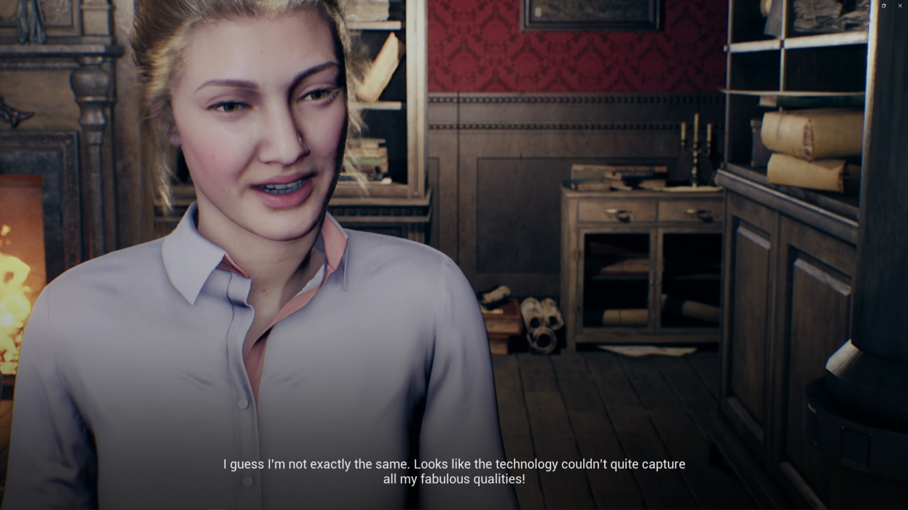

# Portfolio

Francisco "Francisc546" Vasconcelos, Funchal, Portugal, 24 years old.

# Biography

Hello! I'm Francisco Vasconcelos, 24 years old passionate about games and game development, this portfolio offers a demonstration of a couple of the game projects I've worked on. My main interests in game development are level design, testing and polishing issues, creating mechanics, I also have some experience with cinematics and animations.

I have a MSc in Computer Science from University of Madeira and, my first "job" was as a research assistant and game developer at eGamesLab, where I had the chance to work on various game related projects,
expand my Unreal Engine tools knowledge (with non UE tools such as Rokoko suit), and collaborate with colleagues from other disciplines.

I love music, playing games and running. In my spare time I explore more of various aspects of game development.

**Contact: Francisc546@gmail.com**

**[LinkedIn](https://www.linkedin.com/in/francisco-vasconcelos-14503818a/)**

**[Github](https://github.com/Francisc546)**

**[CV](./Francisc546CV.pdf)**

## Projects

### Code name: Txiky

**Type: Game**

Narrative based puzzle platforms, using the thematic of rejection and fennec foxes.

[Github Page](https://github.com/Francisc546/FoxesP1)

[First Prototype](https://francisc546.itch.io/txikyfoxes)

[Learn More](./Txiky.md) 

__Disclaimer__ _:This version of the game has various bugs, to switch version press the button "Fox tricks" in the main menu (PrototypeA - Ashley;PrototypeB - broasdemel)_

### Eidolon

**Type: Game prototype**

Small prototype narrative game about the 5 stages of grief, portrays the first stage Denial, makes use of Unreal Engine 5
and live action sequences to differentiate the "simulation" from the real world events.
 

 
[Itch.io](https://francisc546.itch.io/eidolon)

[Github Page](https://github.com/Francisc546/Rememberme55)

[Learn More](./Eidolon.md)  

### Masters Against FoodWaste

**Type: Game**

Mobile game developed for my MSc Thesis, the itention was to develop an accessible game for the Local Foodbank to share with children
in their school visits. A narrative targetting kids from 8 to 12 years old, with minimalistic graphics and assets, includes character 
customization and trophies for a sense of progression. The game consists of a topdown view of a restaurant and we control a young monkey,
we have different challenges, which are performed in first person point of view, that help the players learn more about food waste.

[Github Page](https://github.com/Varrisco/FoodWasteGame-Trial)

[Google Playstore](https://play.google.com/store/apps/details?id=com.LivLafLuv17Black.MastersCoD&hl=en-US)

[Learn More](./MCoD.md) 

### Satama teaser trailer

**Type: Trailer**

[Video](https://www.youtube.com/watch?v=PdkscGYUdJ8)

## Publications

